<!-- 🌃 CYBERPUNK RED TEAM README :: OPERATOR PROFILE -->

  

  <em style="color:#7df9ff">
    Red Team Operator • Offensive Security • CTF
  </em>

  
  
  

---

## 
༺𓆩 PROFILE 𓆪༻

Operating inside **enterprise-grade networks and self-built offensive labs**,  
with a long-term focus on **offensive security**, **Red Team tradecraft**,  
and **hands-on adversary emulation**.

My work revolves around understanding how real systems fail in practice — not just in theory.  
I spend time breaking down **identity infrastructures**,  
studying **trust relationships**, and tracing how **small configuration mistakes**  cascade into full domain compromise.

I prefer environments that can fight back: monitored networks, hardened hosts, and realistic constraints.

Less noise.  
Less automation-for-show.  
More **intent**, **precision**, and **control**.

---

## 
 TRADECRAFT 

  
  
  
  

My primary areas of practice include:

- **Adversary emulation** using realistic attack paths rather than isolated exploits  
- **Active Directory abuse**, including Kerberos, NTLM, delegation, and trust misconfigurations  
- **Credential operations**, from harvesting to reuse under OPSEC constraints  
- **Post-exploitation workflows**, focusing on persistence, lateral movement, and control  
- Continuous skill refinement through **CTFs**, labs, and failure analysis  

Each technique is treated as part of a chain — never as a standalone trick.

---

## 
 ENVIRONMENT 

  
  
  
  

My workflow spans multiple platforms:

- **Arch Linux & Pop!_OS** as daily drivers for development, research, and lab orchestration  
- **Kali Linux** as a controlled offensive toolkit environment  
- **Windows Active Directory domains** for realistic enterprise attack simulations  

I regularly switch contexts between attacker and administrator  
to better understand both sides of the system.

Daily driver by day.  
Attack surface by night.

---

## 
 TOOLSET 

  
  
  
  
  
  

I treat tools as **instruments**, not identities.

They are used to:
- Validate hypotheses  
- Speed up repeatable tasks  
- Visualize complex relationships  

When tools fail, fundamentals remain.

---

## 
 STACK 

  
  

My technical stack supports:

- **Automation** for reconnaissance, enumeration, and lab management  
- **Scripting** for payload handling and workflow glue  
- **Custom lab building** to reproduce real-world attack scenarios  

The goal is repeatability, not shortcuts.

---

## 
 CONTACT 

  
  

